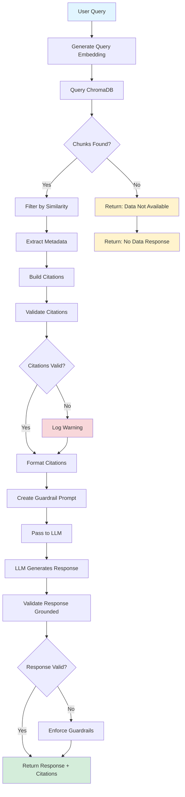

# RAG Retrieval Flow Diagram

## Complete RAG Pipeline Flow



## Detailed Component Flow

```
┌─────────────────────────────────────────────────────────────┐
│                    USER QUERY                                │
│  "What are safety tips for Jaipur?"                          │
└───────────────────────┬─────────────────────────────────────┘
                        │
                        ▼
┌─────────────────────────────────────────────────────────────┐
│              EMBEDDING GENERATION                             │
│  Model: OpenAI text-embedding-3-small                        │
│  Input: "What are safety tips for Jaipur?"                   │
│  Output: [0.123, -0.456, ..., 0.789] (1536 dims)            │
└───────────────────────┬─────────────────────────────────────┘
                        │
                        ▼
┌─────────────────────────────────────────────────────────────┐
│              CHROMADB QUERY                                   │
│  Collection: travel_guides                                    │
│  Query Vector: [0.123, -0.456, ..., 0.789]                  │
│  Filters: { city: "Jaipur", section: "Safety" }              │
│  Top-K: 5, Threshold: 0.4                                    │
└───────────────────────┬─────────────────────────────────────┘
                        │
                        ▼
┌─────────────────────────────────────────────────────────────┐
│              RETRIEVED CHUNKS                                 │
│  ┌─────────────────────────────────────────────────────┐   │
│  │ Chunk 1: similarity=0.92                             │   │
│  │ "Jaipur is generally safe, but be cautious..."      │   │
│  │ metadata: { city: "Jaipur", source: "wikivoyage",   │   │
│  │             section: "Safety",                        │   │
│  │             url: "https://en.wikivoyage.org/..." }   │   │
│  └─────────────────────────────────────────────────────┘   │
│  ┌─────────────────────────────────────────────────────┐   │
│  │ Chunk 2: similarity=0.85                             │   │
│  │ "Avoid displaying expensive items in public..."     │   │
│  │ metadata: { city: "Jaipur", source: "wikivoyage",   │   │
│  │             section: "Safety",                        │   │
│  │             url: "https://en.wikivoyage.org/..." }   │   │
│  └─────────────────────────────────────────────────────┘   │
└───────────────────────┬─────────────────────────────────────┘
                        │
                        ▼
┌─────────────────────────────────────────────────────────────┐
│              CITATION EXTRACTION                              │
│  Input: Retrieved Chunks                                      │
│  Process: Extract unique (source, url) pairs                 │
│  Output:                                                      │
│  [                                                            │
│    {                                                          │
│      source: "Wikivoyage",                                    │
│      url: "https://en.wikivoyage.org/wiki/Jaipur",           │
│      excerpt: "Jaipur is generally safe...",                 │
│      confidence: 0.92                                         │
│    }                                                          │
│  ]                                                            │
└───────────────────────┬─────────────────────────────────────┘
                        │
                        ▼
┌─────────────────────────────────────────────────────────────┐
│              CITATION VALIDATION                              │
│  ✓ Check: source present                                      │
│  ✓ Check: url present and valid                              │
│  ✓ Check: url is accessible                                  │
│  Result: All citations valid                                  │
└───────────────────────┬─────────────────────────────────────┘
                        │
                        ▼
┌─────────────────────────────────────────────────────────────┐
│              CITATION FORMATTING                              │
│  UI Format:                                                   │
│    "1. Wikivoyage - https://en.wikivoyage.org/wiki/Jaipur"  │
│                                                               │
│  Voice Format:                                                │
│    "According to Wikivoyage"                                 │
│                                                               │
│  Markdown Format:                                             │
│    "[1] Wikivoyage - [URL](URL)"                             │
└───────────────────────┬─────────────────────────────────────┘
                        │
                        ▼
┌─────────────────────────────────────────────────────────────┐
│              GUARDRAIL PROMPT                                 │
│  "You may ONLY use the following retrieved information:      │
│                                                               │
│  [Chunk 1 text]                                               │
│  [Chunk 2 text]                                               │
│                                                               │
│  Rules:                                                       │
│  - You MUST cite sources using the provided citations        │
│  - Do NOT make up facts not in the retrieved chunks          │
│  - If information is not in the chunks, say 'not available'"│
└───────────────────────┬─────────────────────────────────────┘
                        │
                        ▼
┌─────────────────────────────────────────────────────────────┐
│              LLM RESPONSE GENERATION                          │
│  Model: GPT-4                                                 │
│  Input: User Query + Guardrail Prompt + Chunks               │
│  Output:                                                      │
│  "Jaipur is generally safe for travelers, but be cautious    │
│   of pickpockets in crowded areas like markets. Avoid         │
│   displaying expensive items in public.                       │
│                                                               │
│   Sources:                                                    │
│   1. Wikivoyage - https://en.wikivoyage.org/wiki/Jaipur"    │
└───────────────────────┬─────────────────────────────────────┘
                        │
                        ▼
┌─────────────────────────────────────────────────────────────┐
│              RESPONSE VALIDATION                              │
│  ✓ Check: Response is grounded in chunks                     │
│  ✓ Check: Citations are included                             │
│  ✓ Check: No hallucinated facts                              │
│  Result: Response is valid and grounded                       │
└───────────────────────┬─────────────────────────────────────┘
                        │
                        ▼
┌─────────────────────────────────────────────────────────────┐
│              FINAL RESPONSE                                   │
│  {                                                            │
│    text: "Jaipur is generally safe...",                      │
│    citations: [                                               │
│      {                                                        │
│        source: "Wikivoyage",                                  │
│        url: "https://en.wikivoyage.org/wiki/Jaipur",         │
│        excerpt: "...",                                        │
│        confidence: 0.92                                       │
│      }                                                        │
│    ],                                                         │
│    hasRAGData: true,                                          │
│    guardrailCheck: { passed: true }                          │
│  }                                                            │
└─────────────────────────────────────────────────────────────┘
```

## Error Handling Flow

```
┌─────────────────────────────────────────────────────────────┐
│                    ERROR SCENARIOS                            │
└─────────────────────────────────────────────────────────────┘

Scenario 1: ChromaDB Connection Failed
┌─────────────────────────────────────────────────────────────┐
│  Error: "CHROMADB_URL environment variable is required"      │
│  → Log error                                                 │
│  → Return: { hasData: false, chunks: [], citations: [] }     │
│  → Continue without crashing                                │
└─────────────────────────────────────────────────────────────┘

Scenario 2: No Chunks Retrieved
┌─────────────────────────────────────────────────────────────┐
│  Query: "What about city X?" (not in database)              │
│  → Similarity scores all < threshold                        │
│  → Return: { hasData: false }                               │
│  → Response: "I don't have specific information about..."   │
└─────────────────────────────────────────────────────────────┘

Scenario 3: Missing Citations
┌─────────────────────────────────────────────────────────────┐
│  Chunks retrieved but metadata missing url/source            │
│  → Guardrail violation detected                              │
│  → Log warning                                               │
│  → Filter out invalid citations                              │
│  → Continue with valid citations only                       │
└─────────────────────────────────────────────────────────────┘

Scenario 4: Embedding API Failure
┌─────────────────────────────────────────────────────────────┐
│  OpenAI API error (rate limit, network, etc.)                │
│  → Retry with exponential backoff (3 attempts)               │
│  → If all retries fail:                                     │
│    → Return: { hasData: false }                             │
│    → Response: "Data not available"                        │
└─────────────────────────────────────────────────────────────┘
```

## Data Flow: Ingestion → Retrieval

```
┌─────────────────────────────────────────────────────────────┐
│                    INGESTION PHASE                           │
│                    (One-time, Offline)                       │
└─────────────────────────────────────────────────────────────┘

1. Fetch Pages
   ┌─────────────────────────────────────────────────────┐
   │ Wikivoyage API → HTML Content                       │
   │ Wikipedia API → HTML Content                         │
   └─────────────────────────────────────────────────────┘
           │
           ▼
2. Parse Sections
   ┌─────────────────────────────────────────────────────┐
   │ Extract: Safety, Eat, Get Around, Weather           │
   │ Clean HTML, remove navigation, keep content          │
   └─────────────────────────────────────────────────────┘
           │
           ▼
3. Chunk Content
   ┌─────────────────────────────────────────────────────┐
   │ Split into ~2000 char chunks                         │
   │ Add 200 char overlap                                 │
   │ Preserve section context                             │
   └─────────────────────────────────────────────────────┘
           │
           ▼
4. Generate Embeddings
   ┌─────────────────────────────────────────────────────┐
   │ OpenAI API: text-embedding-3-small                   │
   │ Batch: 100 chunks                                    │
   │ Output: 1536-dim vectors                             │
   └─────────────────────────────────────────────────────┘
           │
           ▼
5. Store in ChromaDB
   ┌─────────────────────────────────────────────────────┐
   │ Collection: travel_guides                            │
   │ Document: chunk text                                 │
   │ Embedding: 1536-dim vector                           │
   │ Metadata: { city, source, section, url, ... }        │
   └─────────────────────────────────────────────────────┘

┌─────────────────────────────────────────────────────────────┐
│                    RETRIEVAL PHASE                           │
│                    (Runtime, Per Query)                     │
└─────────────────────────────────────────────────────────────┘

1. User Query
   ┌─────────────────────────────────────────────────────┐
   │ "What are safety tips for Jaipur?"                   │
   └─────────────────────────────────────────────────────┘
           │
           ▼
2. Embed Query
   ┌─────────────────────────────────────────────────────┐
   │ Same model: text-embedding-3-small                   │
   │ Output: 1536-dim query vector                        │
   └─────────────────────────────────────────────────────┘
           │
           ▼
3. Vector Search
   ┌─────────────────────────────────────────────────────┐
   │ ChromaDB: cosine similarity search                   │
   │ Filter: city="Jaipur", section="Safety"              │
   │ Top-K: 5, Threshold: 0.4                            │
   └─────────────────────────────────────────────────────┘
           │
           ▼
4. Retrieve Chunks
   ┌─────────────────────────────────────────────────────┐
   │ Return: chunks with similarity scores                │
   │ Extract: citations from metadata                    │
   └─────────────────────────────────────────────────────┘
           │
           ▼
5. Format & Return
   ┌─────────────────────────────────────────────────────┐
   │ Format citations (UI, Voice, Markdown)               │
   │ Create guardrail prompt                              │
   │ Pass to LLM with context                            │
   └─────────────────────────────────────────────────────┘
```

## Citation Enforcement Flow

```
┌─────────────────────────────────────────────────────────────┐
│              CITATION ENFORCEMENT CHECKLIST                  │
└─────────────────────────────────────────────────────────────┘

✓ Step 1: Chunk Metadata Validation
  ┌─────────────────────────────────────────────────────┐
  │ For each retrieved chunk:                            │
  │   ✓ metadata.city exists                             │
  │   ✓ metadata.source exists (wikivoyage/wikipedia)    │
  │   ✓ metadata.url exists and is valid URL              │
  └─────────────────────────────────────────────────────┘

✓ Step 2: Citation Extraction
  ┌─────────────────────────────────────────────────────┐
  │ extractCitationsFromChunks(chunks)                   │
  │   → Group by (source, url)                           │
  │   → Create Citation objects                          │
  │   → Include excerpt and confidence                   │
  └─────────────────────────────────────────────────────┘

✓ Step 3: Citation Validation
  ┌─────────────────────────────────────────────────────┐
  │ validateCitations(citations)                         │
  │   → Check: source present                            │
  │   → Check: url present                               │
  │   → Check: url is valid (URL constructor)            │
  │   → Return: { valid: boolean, errors: [] }           │
  └─────────────────────────────────────────────────────┘

✓ Step 4: Guardrail Check
  ┌─────────────────────────────────────────────────────┐
  │ checkGuardrails(result)                              │
  │   → Rule 1: If hasData, must have citations          │
  │   → Rule 2: Citations must be valid                  │
  │   → Rule 3: Similarity scores reasonable             │
  │   → Return: { passed: boolean, violations: [] }     │
  └─────────────────────────────────────────────────────┘

✓ Step 5: LLM Prompt Enforcement
  ┌─────────────────────────────────────────────────────┐
  │ createGuardrailPrompt(chunks)                        │
  │   → "You may ONLY use the following information:"   │
  │   → "You MUST cite sources:"                         │
  │   → "Do NOT make up facts:"                          │
  └─────────────────────────────────────────────────────┘

✓ Step 6: Response Validation
  ┌─────────────────────────────────────────────────────┐
  │ validateResponseGrounded(response, chunks)            │
  │   → Check: Response mentions citations               │
  │   → Check: No facts outside chunks                   │
  │   → Check: Citations included in response            │
  └─────────────────────────────────────────────────────┘
```

---

**Visual Legend:**
- 🟢 Green: Success path
- 🟡 Yellow: Warning/fallback
- 🔴 Red: Error path
- 🔵 Blue: Input/Output

